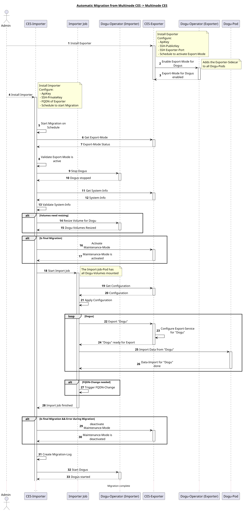

# CES exporter for Multinode CES
The `ces-exporter` for Multinode CES is a CES component that provides the data of the Multinode CES instance for migration to another Multinode CES instance.

## Migration procedure
The basic migration process from one multinode CES instance to another multinode CES instance is described in the following diagram:


## API of the CES exporter
The API of the `ces-exporter` is described in the following OpenAPI specification: [openapi.yaml](./openapi.yaml)

## Development in the DEV CES cluster
To test the `ces-exporter` component in a CES cluster, the following make targets can be used:

### ApiKey
The API of the `ces-exporter` requires an ApiKey. This must be provided as a secret.
The Make target `make apikey-secret` can be used for development.
This creates the secret `ces-exporter-api` with the ApiKey from the environment variable `EXPORTER_API_KEY`.
This environment variable can also be specified in the `.env` file.

### Importer SSH public key
To give the `ces-importer` access to the data of the `ces-exporter`, the SSH public key of the `ces-importer` must be stored in the `ces-exporter`.
The SSH-PublicKey in the Exporter-SideCar-Container to the Dogus is used to grant access to the volume data of the Dogus.

When installing the `ces-exporter`, the ConfigMap `ces-importer-public-key` is created with the PublicKey.
The environment variable `IMPORTER_PUBLIC_KEY` can be used for development.
The value of this variable is templated in the `values.yaml`.
This environment variable can also be specified in the `.env` file.

### Installation via helmet

```bash
# Installs the Helm chart from ces-exporter in the cluster (without the CES component)
make helm-apply
```

```bash
# Deletes the helmet chart of ces-exporter from the cluster (without the CES component)
make helm-delete
```

### Installation as component

```bash
# Installs ces-exporter in the cluster
make component-apply
```

```bash
# Deletes ces-exporter from the cluster
make component-delete
```

```bash
# Deletes ces-exporter from the cluster and then reinstalls it
make component-reinstall
```
